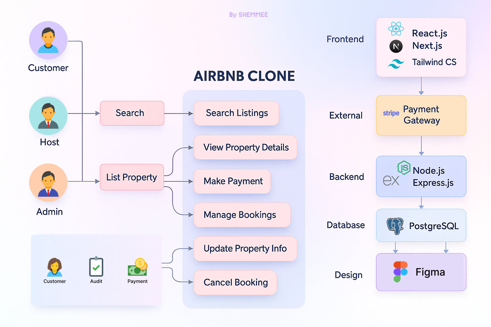

<h1 align="center"><em>Requirement Analysis in Software Development</em></h1>

## 📌 About the Project

This repository is part of the ALX Software Engineering Program. It documents the Requirement Analysis phase for a booking management system, simulating a real-world software planning process. It includes definitions, structured documentation, diagrams, and criteria that lay the groundwork for a successful system design and implementation.

---

## 🔍 What is Requirement Analysis?

Requirement Analysis is the process of identifying, gathering, analyzing, and documenting the needs and expectations of stakeholders for a software system. It is a crucial step in the Software Development Life Cycle (SDLC) because it sets the foundation upon which the entire system will be built.

It involves:
- Understanding user and system needs.
- Defining functional and non-functional specifications.
- Creating visual models of user interactions and flows.
- Establishing clear criteria to validate successful implementation.

---

## 🚀 Why is Requirement Analysis Important?

1. **Reduces Development Risks**  
   Clear requirements minimize the risk of miscommunication and scope creep.

2. **Improves System Quality**  
   Well-defined requirements lead to systems that better meet user needs.

3. **Enhances Team Alignment**  
   Everyone involved (developers, stakeholders, testers) operates with a shared understanding of expectations.

---

## 🔑 Key Activities in Requirement Analysis

- **Requirement Gathering**  
  Collecting needs from stakeholders through interviews, questionnaires, or observation.

- **Requirement Elicitation**  
  Clarifying, probing, and refining those needs into actionable software expectations.

- **Requirement Documentation**  
  Structuring all gathered information into formal documents (e.g., SRS, user stories).

- **Requirement Analysis and Modeling**  
  Creating diagrams or models to visualize and validate the relationships and flow.

- **Requirement Validation**  
  Ensuring all documented requirements align with business goals and user expectations.

---

## 🧩 Types of Requirements

### ➤ Functional Requirements

These define what the system **should do**:

- Users can search for hotels by location and date.
- Customers can create, modify, and cancel bookings.
- Hotel managers can list, update, and manage room availability.
- System integrates with a third-party payment provider to process transactions.

### ➤ Non-Functional Requirements

These define **how** the system performs:

- The system must handle 10,000+ concurrent users.
- API responses should return within 300ms on average.
- The booking platform must support mobile and web browsers.
- Data should be backed up daily and encrypted during transit.

---

## 🧰 Use Case Diagrams

Use Case Diagrams help visualize the interactions between users (actors) and system features.

### Actors
- **Customer**
- **Hotel Manager**
- **System (Payment API, Search Engine, etc.)**

### Use Cases
- Search Hotel  
- Book Hotel  
- View Booking  
- Cancel Booking  
- List Hotel  
- Update Room Availability  
- Process Payment

---

## ✅ Acceptance Criteria

Acceptance Criteria define the conditions under which a feature is complete and accepted.

**Example: Checkout Feature**

- The system must verify that user is authenticated.
- Booking details are reviewed before final confirmation.
- Payment must be processed successfully via the third-party gateway.
- A booking confirmation page is displayed and emailed to the user.
- The booking is stored in the database and shown under “My Bookings.”

> Good acceptance criteria improve clarity, reduce bugs, and make testing more effective.

---

<em>Happy Coding! :)</em>

